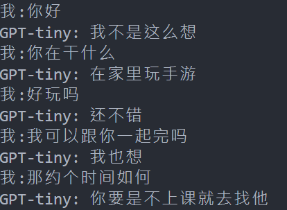

### NLP
The following are the websites I referred to:
1. [github Nlp-toturial](https://github.com/graykode/nlp-tutorial/blob/master/5-2.BERT/BERT.py)
2. [Bert model toturial in chinese](https://www.bilibili.com/video/BV1Kb4y187G6?p=2&vd_source=eedb40643793ea7852c5f0638ff5932c)
3. [Let's build GPT: from scratch, in code, spelled out.](https://www.youtube.com/watch?v=kCc8FmEb1nY&ab_channel=AndrejKarpathy)
4. [Gpt introduce and implemention](https://blog.csdn.net/weixin_44599230/article/details/124103879)

### Goal
1. Understand the model and try to implementation

### Transformer
I split evey part in model
you can rapid to find you want part

### Bert
I make every code has comment


### GPT-Tiny
1. I make every code has comment
2. Greedy_decode vs Random_decode
3. Now only has Simplified Chinese dataset

It can make a conversation 
use
```
python detect.py
```
demo

